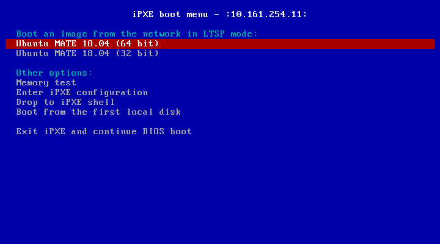

# Unofficial UEFI netbooting support for LTSP5

You're supposed to be running LTSP5 with dnsmasq as DHCP and TFTP server.
This will switch you from PXELinux to iPXE and GRUB,
in order to support UEFI clients even with 32 bit LTSP images.

To download and run the installer:

```shell
wget https://raw.githubusercontent.com/alkisg/ltsp5-uefi/master/ltsp5-uefi -O /tmp/ltsp5-uefi
sudo sh /tmp/ltsp5-uefi
```

Afterwards, you might want to customize the following files:

 - /etc/dnsmasq.d/ltsp-server-dnsmasq.conf
 - /var/lib/tftpboot/ltsp/ltsp.ipxe

**Do not run `ltsp-config dnsmasq`** after installing ltsp5-uefi,
as it will overwrite the UEFI-capable /etc/dnsmasq.d/ltsp-server-dnsmasq.conf file.


